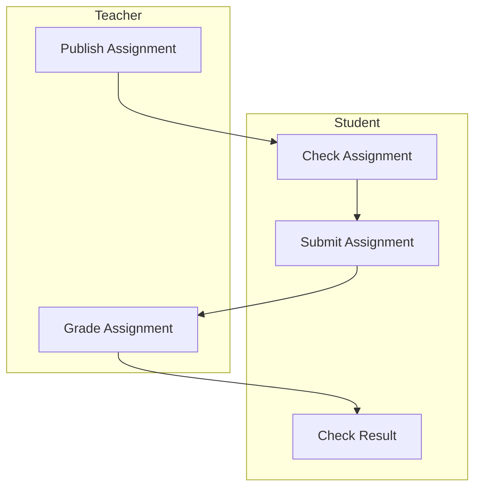

# DESIGN DOC

## Flow

## Features

- Complete flow of assignment submission, management and grading.
- Support computing AIGC rate of submitted assignment.
- Support plagiarism checking for assignments in a same assignment.
- Pretty visual graphs for teachers and students to check the status of
  assignment submission and grading.

## Architecture

HC-RE utilize C/S architecture.

### Frontend

- Student interface
  - Submit page
  - Assignments checking page
    - Details of assignments page
- Teacher interface
  - Assignment management page (Add, Edit, Delete)
  - Submission grading page
- Administrator interface
  - Server management page

In frontend (client), 

